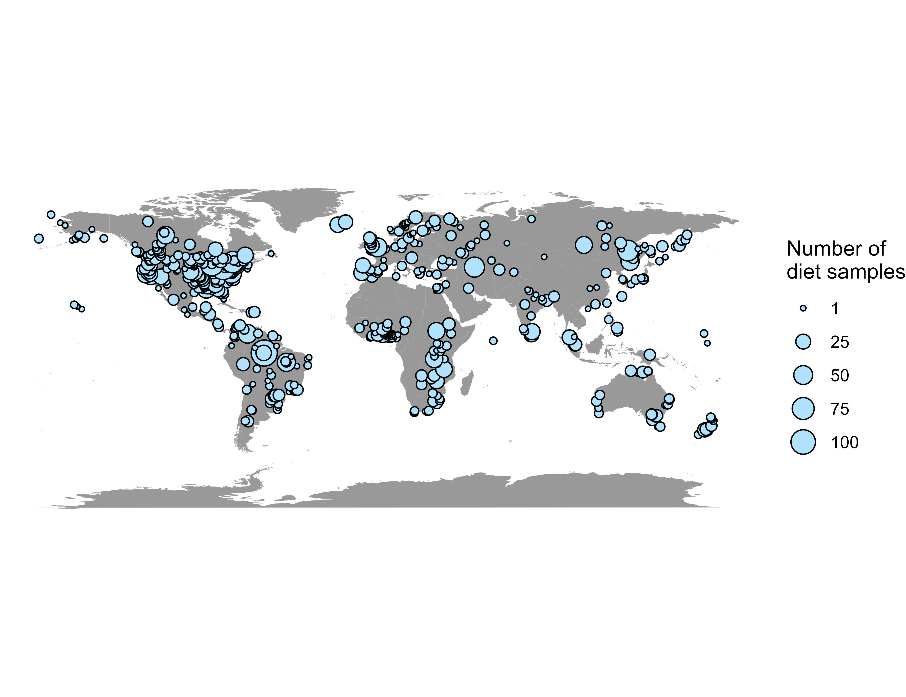

Trophish
================
Jacob Ridgway and Jeff Wesner

## Summary

Trophish contains dietary data gleaned from the literature for 100’s of
freshwater fish species. The purpose of Trophish is to allow assessment
of freshwater fish stomach contents (Ridgway 2022).

We extracted information from dietary reports ranging from the 1890’s to
present. The data set is located in `data/trophish_dataset.csv`.

Global coverage is represented by the map below:

Figure 1. Map of locations where dietary information was exctracted.

## Approach

This database was compiled through searches of the primary and secondary
literature. Secondary literature included “gray” literature, defined as
non peer-reviewed reports or theses. After an initial broad search,
subsequent searches were targeted to fill any obvious taxonomic or
geographic gaps. A full explanation is given in Ridgway (2022).

## References

Ridgway, Jacob M. 2022. “TROPHISH: BUILDING A GLOBAL DATABASE OF
FRESHWATER TROPHIC INTERACTIONS.” Honors Thesis.
<https://red.library.usd.edu/honors-thesis/259>.

